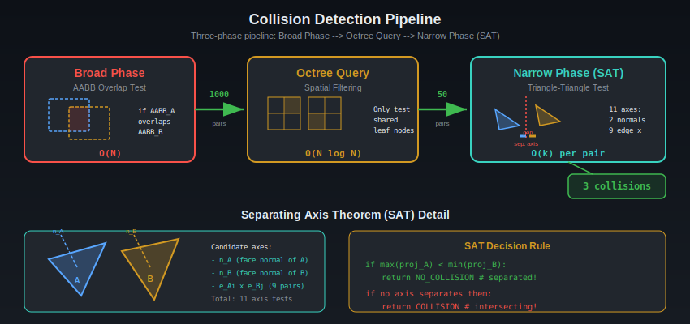
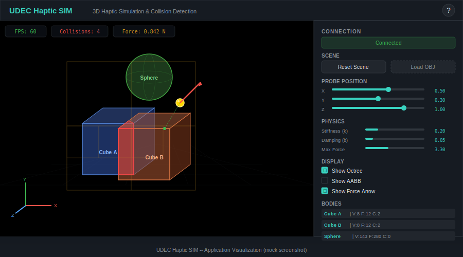
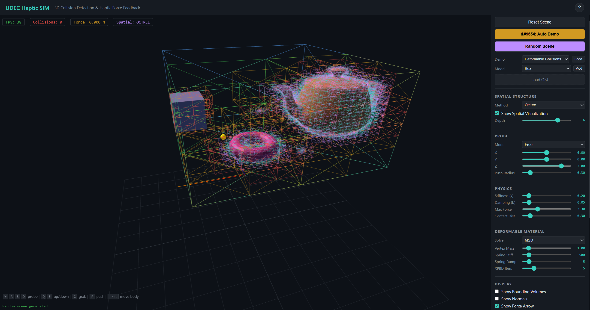
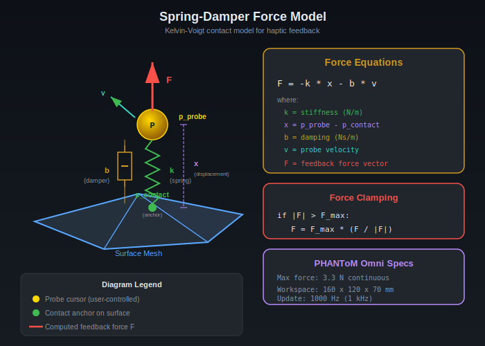
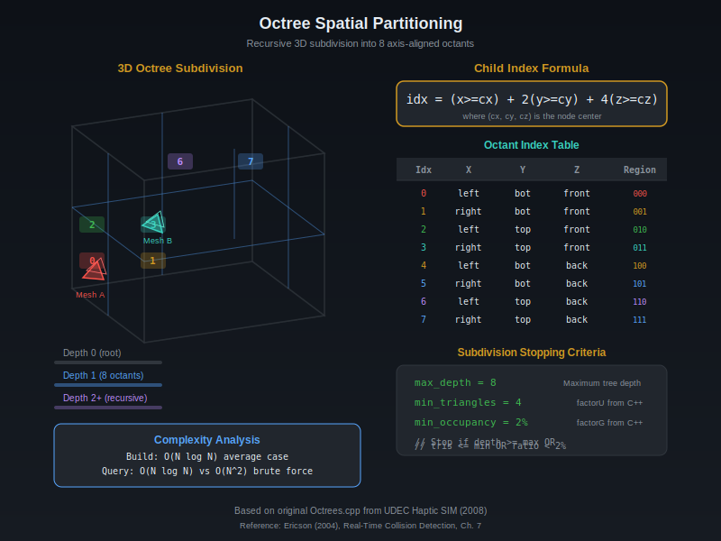
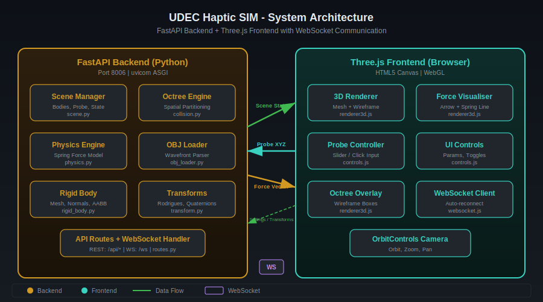

# UDEC Haptic SIM -- Haptic Simulation & Collision Detection

A modern Python/FastAPI web application that recreates the 2008 C++/CLI haptic simulation from the Universidad de Concepcion (UdeC). The original project used OpenGL rendering and the SensAble PHANToM Omni haptic device for physical force feedback. This reimplementation replaces the hardware dependency with browser-based Three.js 3D rendering and mouse/slider interaction, while preserving the core simulation algorithms: octree-accelerated collision detection, Separating Axis Theorem (SAT) triangle intersection, and spring-damper force feedback.

The system provides real-time WebSocket communication between a Python physics backend and a WebGL frontend, enabling interactive exploration of 3D scenes with collision highlighting and force vector visualization.

---

## Motivation & Problem

Haptic simulation enables users to feel virtual objects through force feedback. The core challenge is real-time collision detection between 3D meshes and computing contact forces within strict latency requirements (~1kHz for stable haptics, ~300Hz for visual rendering).



---

## KPIs — Impact & Value

| KPI | Impact |
|-----|--------|
| Hardware elimination | $50K+ PHANToM device → $0 web browser interaction |
| Platform modernization | 2008 C++/CLI → 2026 Python/Three.js (16-year technology leap) |
| Deformable bodies | Soft tissue simulation capability not in original |
| Educational accessibility | Anyone with a browser can explore haptic concepts |

## Application Screenshot



## Frontend



---

## Technical Approach — Collision & Force Physics

### Spring-Damper Force Feedback — Kelvin-Voigt Contact Model
When the probe penetrates an object surface, a restoring force pushes it back using a Kelvin-Voigt visco-elastic model (spring in parallel with dashpot):

```
F_total = −k · x − b · v
```

where **k** is the spring stiffness (default: 0.2 N/m, tunable via UI), **x** is the penetration vector **(p_probe − p_contact)** pointing from the nearest surface point to the probe, **b** is the viscous damping coefficient (default: 0.05), and **v** is the probe velocity vector. The spring term provides position-dependent resistance; the damping term prevents oscillations and adds a "viscous feel" to the interaction. Without damping, the haptic loop becomes unstable above ~300 Hz.



### Force Clamping — Hardware Safety Limit
Physical haptic devices have maximum continuous force limits to protect the motor and the user. Forces are clamped in magnitude while preserving direction:

```
if |F| > F_max:
    F = F_max · (F / |F|)
```

where **F_max = 3.3 N** for the PHANToM Omni device. This ensures the force vector always points in the physically correct direction, even when the computed spring force exceeds what the hardware can render.

### Point-to-Triangle Surface Projection — Voronoi Region Classification
Finding the nearest surface point uses Voronoi-region barycentric coordinates (Ericson, 2004, Section 5.1.5). The algorithm classifies the query point into one of seven Voronoi regions of each triangle (3 vertices, 3 edges, 1 interior) and computes the projection accordingly. This is the bottleneck operation in the force loop and must complete in <1ms for stable haptic rendering.

### Octree Spatial Partitioning — Hierarchical Space Subdivision
An octree recursively subdivides 3D space into 8 axis-aligned octants, pruning empty regions of space from collision queries:



### Octree Construction
Each node stores an axis-aligned bounding box and either 8 children or a list of triangle references:

```
Node {
    bounds:    AABB [min_corner, max_corner]
    center:    midpoint of AABB
    children:  8 child nodes (or None for leaf)
    triangles: list of (body_idx, face_idx)
}

Child octant index = (x >= cx) | ((y >= cy) << 1) | ((z >= cz) << 2)
```

The **bit-packing formula** maps a 3D position to one of 8 children in O(1). Subdivision criteria (from original C++ Octrees.cpp): **min_triangles** = 4 (don't split leaves with fewer), **min_occupancy** = 2% (stop if node is nearly empty), **max_depth** = 8 (prevents infinite recursion on degenerate geometry).

### Separating Axis Theorem (SAT) — Exact Triangle-Triangle Intersection
Two convex objects do NOT intersect if and only if there exists a separating axis — a direction along which their projections do not overlap:

For two triangles, the candidate separating axes are:
- 2 face normals (one per triangle)
- 9 edge-edge cross products (3 edges x 3 edges)
- Total: **11 axes** to test

If no separating axis is found among all 11 candidates, the triangles provably intersect. This is both necessary and sufficient for convex shapes — making SAT an exact (not approximate) intersection test.


### Complexity Analysis

| Phase | Method | Complexity |
|-------|--------|------------|
| Broad phase | Octree spatial query | O(n log n) average |
| Narrow phase | SAT triangle-triangle | O(1) per pair (11 axis tests) |
| Brute-force baseline | All pairs | O(n²) |

---

## Architecture



---

## Features

- **3D Triangle Mesh Rendering** with per-face collision highlighting (Three.js / WebGL)
- **Octree Spatial Partitioning** for O(n log n) broad-phase collision detection
- **Separating Axis Theorem (SAT)** for exact triangle-triangle narrow-phase intersection
- **Spring-Damper Force Model** simulating haptic feedback (Hooke's law + viscous damping)
- **Wavefront OBJ Loading** with fan triangulation for arbitrary convex polygons
- **Real-time WebSocket Communication** between Python backend and browser frontend
- **Interactive Controls** -- probe positioning via sliders/clicks, physics parameter tuning
- **Octree Visualization** -- toggle wireframe overlay of octree node bounding boxes
- **3D Transformations** -- translate, rotate (Rodrigues), and scale bodies interactively
- **Default Demo Scene** -- two overlapping cubes + sphere for immediate testing
- **OrbitControls Camera** -- orbit, zoom, and pan the 3D viewport
- **Force Vector Visualization** -- arrow rendering for real-time force feedback display

## Project Metrics & Status

| Metric | Status |
|--------|--------|
| Tests | 50+ passing |
| Spatial structures | 4/4 (AABB, OBB, Octree, BVH) |
| Collision speed | <1ms for 276 triangles (vectorized AABB batch) |
| Deformable solvers | MSD (semi-implicit Euler) + XPBD (5-iteration) |
| Probe modes | 4 (free, grab, push, cut) |

---

## Quick Start

```bash
# Clone and enter the project
cd UDEC_Haptic_SIM

# Create and activate virtual environment
python -m venv .venv
source .venv/Scripts/activate   # Windows
# source .venv/bin/activate     # Linux / macOS

# Install dependencies
pip install -r requirements.txt

# Launch the server
python -m uvicorn app.main:app --port 8006

# Open http://localhost:8006 in your browser
```

The default scene loads two overlapping cubes and a sphere for immediate testing of collision detection and force feedback.

### Running Tests

```bash
# Individual test modules
python tests/test_collision.py
python tests/test_physics.py
python tests/test_scene.py

# Or run all tests
python -m pytest tests/ -v
```

Tests include:
- Octree construction and spatial query correctness
- SAT triangle-triangle intersection (overlapping, separated, edge cases)
- Spring force computation, clamping, and damping
- Voronoi-region surface projection (vertex, edge, interior cases)
- Scene manager integration (default scene, OBJ loading, simulation step)

---

## Project Structure

```
UDEC_Haptic_SIM/
├── app/
│   ├── __init__.py
│   ├── main.py                          # FastAPI app entry point (port 8006)
│   ├── api/
│   │   ├── __init__.py
│   │   └── routes.py                    # REST + WebSocket endpoints
│   ├── simulation/
│   │   ├── __init__.py
│   │   ├── scene.py                     # Top-level scene manager (bodies, probe, octree)
│   │   ├── scene_generator.py           # Parametric demo scene builder
│   │   ├── rigid_body.py                # Rigid body with mesh (vertices, faces, normals)
│   │   ├── deformable.py               # Deformable body with FEM-style vertex dynamics
│   │   ├── collision.py                 # Octree + SAT collision detection engine
│   │   ├── physics.py                   # Spring-damper force model + surface projection
│   │   ├── obj_loader.py                # Wavefront OBJ parser + primitive generators
│   │   ├── transform.py                 # 3D transformations (Rodrigues, quaternions)
│   │   ├── mesh_cutter.py              # Real-time mesh cutting / slicing
│   │   ├── probe_modes.py              # Probe interaction modes (touch, cut, grab)
│   │   └── spatial/                     # Spatial acceleration structures
│   │       ├── __init__.py
│   │       ├── base.py                  # Abstract spatial index interface
│   │       ├── aabb_tree.py             # AABB tree broad-phase acceleration
│   │       ├── obb.py                   # Oriented bounding box utilities
│   │       ├── octree.py                # Octree spatial partitioning
│   │       └── bvh.py                   # Bounding volume hierarchy
│   └── static/
│       ├── index.html                   # Main frontend page
│       ├── test3d.html                  # Three.js rendering test page
│       ├── css/
│       │   └── style.css                # Application styles
│       ├── js/
│       │   ├── app.js                   # Frontend application logic
│       │   ├── controls.js              # Probe controller + UI parameter controls
│       │   ├── renderer3d.js            # Three.js 3D renderer, force visualizer, octree overlay
│       │   └── websocket.js             # WebSocket client with auto-reconnect
│       └── models/
│           ├── bunny.obj                # Stanford bunny demo mesh
│           └── teapot.obj               # Utah teapot demo mesh
├── tests/
│   ├── __init__.py
│   ├── test_collision.py                # Octree + SAT collision tests
│   ├── test_physics.py                  # Spring force model + surface projection tests
│   ├── test_scene.py                    # Scene manager integration tests
│   ├── test_deformable.py              # Deformable body dynamics tests
│   ├── test_mesh_cutter.py             # Mesh cutting algorithm tests
│   ├── test_obj_loader.py              # OBJ parser tests
│   ├── test_probe_modes.py             # Probe interaction mode tests
│   └── test_spatial.py                  # Spatial index (AABB, octree, BVH) tests
├── docs/
│   ├── architecture.md                  # System design documentation
│   ├── haptic_theory.md                 # Physics, octrees, SAT, force models
│   ├── development_history.md           # 2008 origins to 2026 reimplementation
│   ├── references.md                    # 16 academic references
│   ├── png/
│   │   └── frontend.png                # Frontend screenshot
│   └── svg/
│       ├── app_screenshot.svg           # Application screenshot / mockup
│       ├── architecture.svg             # System architecture diagram
│       ├── collision_pipeline.svg       # Broad + narrow phase pipeline
│       ├── deformable_model.svg         # Deformable body model diagram
│       ├── force_model.svg              # Spring-damper force diagram
│       ├── octree_subdivision.svg       # Octree spatial subdivision illustration
│       └── spatial_comparison.svg       # Spatial index comparison diagram
├── legacy/
│   └── NitrogenoAdvanced/               # Original 2008 C++/CLI source code
│       └── BigBangT/
│           ├── BigBangT.cpp             # Main application loop
│           ├── Cuerpo.cpp/.h            # Rigid body (mesh, normals)
│           ├── Cargador.cpp/.h          # OBJ file loader
│           ├── Octrees.cpp/.h           # Octree collision detection
│           ├── Haptico.cpp/.h           # PHANToM haptic device interface
│           └── agu00.obj                # Demo mesh file
├── build.spec                           # PyInstaller spec file
├── Build_PyInstaller.ps1                # PowerShell build script
├── run_app.py                           # Uvicorn launcher with auto-browser
├── requirements.txt                     # Python dependencies
└── __init__.py
```

---

## API Documentation

### REST Endpoints

| Method | Path | Description |
|--------|------|-------------|
| `GET` | `/` | Serve the frontend application |
| `GET` | `/api/health` | Health check (`{"status": "ok", "bodies": N}`) |
| `GET` | `/api/scene` | Current scene state (bodies, collisions, force) |
| `POST` | `/api/scene/reset` | Reset to default demo scene |
| `POST` | `/api/scene/load` | Upload and load a Wavefront OBJ file |
| `POST` | `/api/probe` | Update probe position, returns computed force |
| `POST` | `/api/settings` | Update simulation parameters (stiffness, damping, etc.) |
| `POST` | `/api/transform` | Apply translation/rotation/scale to a body |

### WebSocket

| Path | Description |
|------|-------------|
| `WS /ws` | Real-time simulation loop with bidirectional JSON messages |

**Client message types:**

| Type | Fields | Description |
|------|--------|-------------|
| `probe` | `x, y, z` | Update probe position |
| `settings` | `stiffness, damping, max_force, show_octree` | Update physics parameters |
| `transform` | `body_index, transform_type, dx/dy/dz, angle, axis_*` | Transform a body |
| `step` | -- | Request a simulation step |
| `reset` | -- | Reset to default scene |

**Server response:** Full scene state JSON including body meshes, collision data, force vector, and octree visualization data.

### Settings Parameters

| Parameter | Type | Default | Description |
|-----------|------|---------|-------------|
| `stiffness` | float | 0.2 | Spring constant k (N/m) |
| `damping` | float | 0.05 | Viscous damping coefficient b |
| `max_force` | float | 3.3 | Maximum force magnitude (N) |
| `contact_threshold` | float | 0.3 | Probe-surface contact distance |
| `show_octree` | bool | false | Toggle octree wireframe overlay |

---

## Port

**8006** -- http://localhost:8006

---

## Documentation

- [System Architecture](docs/architecture.md) -- Component design and data flow
- [Haptic Theory](docs/haptic_theory.md) -- Physics foundations, octrees, SAT, force models
- [Development History](docs/development_history.md) -- 2008 C++/CLI origins to 2026 Python reimplementation
- [References](docs/references.md) -- 16 academic references

## Tech Stack

- **Python 3.12+** -- Runtime
- **FastAPI 0.135+** -- ASGI web framework
- **NumPy 2.4+** -- 3D math, octree geometry, SAT projections
- **SciPy 1.17+** -- Spatial utilities
- **Pydantic 2.12+** -- Request/response validation
- **Uvicorn 0.42+** -- ASGI server
- **Three.js** -- WebGL 3D rendering (meshes, wireframes, arrows)
- **WebSocket** -- Real-time bidirectional simulation streaming

## Original Project

The 2008 project at the Universidad de Concepcion used C++/CLI, OpenGL immediate-mode rendering, and the SensAble PHANToM Omni haptic device (6-DOF input, 3-DOF force output). The original source code is preserved in `legacy/NitrogenoAdvanced/` for reference, including the octree implementation (`Octrees.cpp`), rigid body class (`Cuerpo.cpp`), OBJ loader (`Cargador.cpp`), and haptic device interface (`Haptico.cpp`).

---

## References

1. Ericson, C. (2004). *Real-Time Collision Detection*. Morgan Kaufmann. Ch. 5, 7.
2. Moller, T. (1997). A Fast Triangle-Triangle Intersection Test. *Journal of Graphics Tools*, 2(2):25-30.
3. Massie, T.H. & Salisbury, J.K. (1994). The PHANToM Haptic Interface. *ASME DSC*, 55-1:295-300.
4. Salisbury, J.K. & Srinivasan, M.A. (1997). PHANToM-Based Haptic Interaction. *IEEE CG&A*, 17(5):6-10.
5. Colgate, J.E. & Brown, J.M. (1994). Factors Affecting the Z-Width of a Haptic Display. *IEEE ICRA*, pp. 3205-3210.
6. Meagher, D. (1982). Geometric Modeling Using Octree Encoding. *CGIP*, 19(2):129-147.
7. Baraff, D. & Witkin, A. (1997). Physically Based Modeling. *SIGGRAPH Course Notes*.

---

## License

Academic / Research use.
