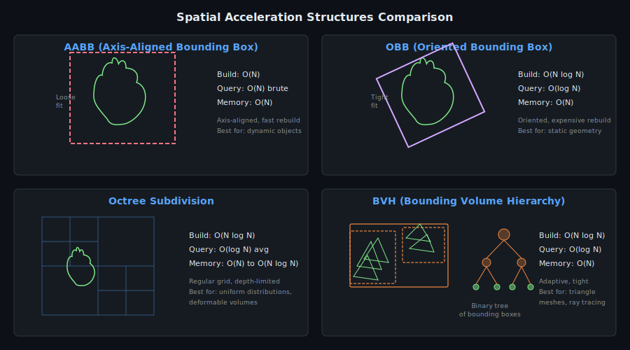

# Haptic Simulation Theory

A comprehensive reference covering the physics, computer science, and engineering principles behind the UDEC Haptic SIM project.

---

## 1. History of Haptic Interfaces

### 1.1 Origins

The word "haptic" derives from the Greek *haptikos* (able to touch). Haptic technology aims to recreate the sense of touch by applying forces, vibrations, or motions to the user.

The field began in the 1960s with master-slave telemanipulators for nuclear material handling (Goertz, 1954). The first general-purpose haptic interface for virtual environments was the **Argonne Remote Manipulator** (ARM), developed at Argonne National Laboratory.

### 1.2 The PHANToM Device Family

The **PHANToM** (Personal Haptic Interface Mechanism) was developed at MIT by Thomas Massie and Kenneth Salisbury in 1993. It became the most widely used haptic device in research.

**PHANToM Omni (SensAble Technologies)**:
- 6 DOF position sensing (x, y, z, roll, pitch, yaw)
- 3 DOF force feedback (x, y, z)
- Maximum continuous force: 3.3 N
- Maximum stiffness: 2.31 N/mm
- Workspace: 160 mm x 120 mm x 70 mm
- Position resolution: ~0.055 mm
- Haptic update rate: 1000 Hz (1 kHz)

The original 2008 UDEC project used the PHANToM Omni via the **OpenHaptics** SDK (SensAble Technologies / 3D Systems). This web-based recreation replaces the hardware probe with mouse/slider interaction.

### 1.3 Modern Haptic Devices

Since the PHANToM, numerous devices have been developed:
- **Novint Falcon** (consumer-grade 3-DOF, 2007)
- **Force Dimension omega/delta** (high-precision research)
- **Haption Virtuose** (industrial applications)
- **Touch X / Touch (3D Systems)** -- successors to PHANToM

---

## 2. Spring-Damper Force Model

### 2.1 Hooke's Law (Spring Force)

The fundamental contact force model uses Hooke's law. When the probe penetrates a virtual surface, the restoring force is:

```
F_spring = -k * (p_probe - p_contact)
```

where:
- `k` is the spring stiffness constant (N/m)
- `p_probe` is the current probe position
- `p_contact` is the nearest point on the surface (the "anchor")

### 2.2 Viscous Damping

To prevent oscillations at the contact boundary, a viscous damping term is added:

```
F_damping = -b * v_probe
```

where `b` is the damping coefficient (Ns/m) and `v_probe` is the probe velocity.

### 2.3 Combined Kelvin-Voigt Model

The total contact force is the sum:

```
F_total = -k * x - b * v
```

This is the **Kelvin-Voigt** model -- a spring and dashpot in parallel. It is the standard contact model in haptic rendering due to its simplicity and numerical stability.

### 2.4 Force Clamping

Physical devices have maximum continuous force limits. For the PHANToM Omni, F_max = 3.3 N. The computed force is clamped:

```
if |F| > F_max:
    F = F_max * (F / |F|)
```

### 2.5 Stability Considerations

Haptic rendering stability requires:
- High update rate (>= 1 kHz for rigid contacts)
- Stiffness below the device maximum (passivity constraint)
- Sufficient damping to avoid limit cycles

The **Z-width** (Colgate & Brown, 1994) characterizes the range of impedances a haptic display can stably render. For a discrete-time system with sample period T:

```
k_max = 2 * b / T
```

In our web simulation at ~10 Hz update rate, we use much lower stiffness values than a real 1 kHz haptic loop would require.

---

## 3. Octree Spatial Partitioning

### 3.1 Concept

An **octree** recursively subdivides 3D space into eight axis-aligned octants. It is the 3D analog of a quadtree (2D) and binary tree (1D).

Each node stores:
- Axis-Aligned Bounding Box (AABB)
- Up to 8 child nodes
- References to triangles whose AABBs intersect the node

### 3.2 Construction

```
BUILD(node, triangles):
    if stopping criteria met:
        node.triangles = triangles
        return

    Compute center of node AABB
    Create 8 child nodes
    For each triangle:
        Compute triangle AABB
        Insert into each child whose AABB intersects triangle AABB

    For each non-empty child:
        BUILD(child, child.triangles)
```

### 3.3 Child Indexing

The 8 children are indexed by a 3-bit code:

```
index = (x >= center_x) + 2*(y >= center_y) + 4*(z >= center_z)
```

| Index | Binary | X | Y | Z |
|-------|--------|---|---|---|
| 0 | 000 | left | bottom | front |
| 1 | 001 | right | bottom | front |
| 2 | 010 | left | top | front |
| 3 | 011 | right | top | front |
| 4 | 100 | left | bottom | back |
| 5 | 101 | right | bottom | back |
| 6 | 110 | left | top | back |
| 7 | 111 | right | top | back |

### 3.4 Stopping Criteria

From the original C++ `Octrees.cpp`:
- **max_depth**: Maximum recursion depth (default: 8)
- **min_triangles** (factorU): Minimum triangle count to subdivide (default: 4)
- **min_occupancy** (factorG): Minimum fraction of total triangles (default: 2%)

### 3.5 Complexity Analysis

| Operation | Brute Force | Octree |
|-----------|-------------|--------|
| Build | -- | O(N log N) average |
| All-pairs query | O(N^2) | O(N log N) average |
| Point query | O(N) | O(log N) |
| Memory | O(N) | O(N) to O(N log N) |

---

## 4. Separating Axis Theorem (SAT)

### 4.1 Theory

The **Separating Axis Theorem** states: two convex shapes do not intersect if and only if there exists a line (axis) onto which their projections do not overlap.

For two convex polyhedra, the candidate separating axes are:
1. Face normals of polyhedron A
2. Face normals of polyhedron B
3. Cross products of edge pairs (one edge from each polyhedron)

### 4.2 Triangle-Triangle Case

For two triangles, the candidate axes are:
- 2 face normals (n_A, n_B)
- 9 edge-edge cross products (3 edges of A x 3 edges of B)
- Total: 11 axes

For each axis:
1. Project all 6 vertices onto the axis
2. Compute the projection intervals [min_A, max_A] and [min_B, max_B]
3. If `max_A < min_B` or `max_B < min_A`, the axis separates -- no collision

If no separating axis is found among all 11 candidates, the triangles intersect.

### 4.3 Degenerate Cases

When an edge cross product has near-zero magnitude, it produces a degenerate axis (parallel edges). These are skipped to avoid numerical issues.

### 4.4 Algorithm Complexity

Each SAT test is O(1) -- exactly 11 axis projections with 6 dot products each. This makes it efficient as a narrow-phase test after broad-phase filtering.

---

## 5. Wavefront OBJ Format

### 5.1 Specification

The Wavefront OBJ format (Silicon Graphics, 1995) is a text-based 3D geometry format.

```
# Comment
v x y z          # Vertex position
vn nx ny nz      # Vertex normal
vt u v           # Texture coordinate
f v1 v2 v3       # Face (1-based indices)
f v1/t1 v2/t2    # Face with texture
f v1/t1/n1       # Face with texture and normal
f v1//n1          # Face with normal only
```

### 5.2 Triangulation

Polygons with more than 3 vertices are triangulated by fan decomposition:

For polygon [v0, v1, v2, ..., vN]:
- Triangle 0: (v0, v1, v2)
- Triangle 1: (v0, v2, v3)
- ...
- Triangle N-2: (v0, v_{N-1}, v_N)

### 5.3 Original C++ Loader

The original `Cargador.cpp` parsed only `v` and `f` lines. It stored vertices in a flat float array and faces as integer triples. The Python `obj_loader.py` returns numpy arrays suitable for the `RigidBody` constructor.

---

## 6. Rigid Body Dynamics

### 6.1 State Representation

A rigid body's state is defined by:
- Position: center of mass **p** = (x, y, z)
- Orientation: rotation matrix R in SO(3) or quaternion q
- Linear velocity: **v** = d**p**/dt
- Angular velocity: **w** (rotation rate vector)

### 6.2 Equations of Motion

Newton's second law for translation:
```
m * a = sum(F_external)
```

Euler's equation for rotation:
```
I * dw/dt + w x (I * w) = sum(T_external)
```

where I is the inertia tensor and T is torque.

### 6.3 Simplified Model

In the haptic simulation, we use a simplified kinematic model:
- Objects are moved by user input (sliders/buttons)
- No gravity, friction, or dynamic response
- Collision detection identifies penetrating face pairs
- Force feedback is computed only for the probe-to-surface interaction

---

## 7. Real-Time Collision Detection Pipeline

### 7.1 Three-Phase Pipeline


1. **Broad Phase**: AABB overlap tests eliminate obviously non-colliding pairs. O(N).
2. **Mid Phase (Octree)**: Spatial partitioning reduces candidate pairs from O(N^2) to O(N log N).
3. **Narrow Phase (SAT)**: Exact triangle-triangle intersection for remaining candidates. O(1) per pair.

### 7.2 AABB Properties

An Axis-Aligned Bounding Box (AABB) is defined by two corners:
```
AABB = { min_corner: [x_min, y_min, z_min],
         max_corner: [x_max, y_max, z_max] }
```

Two AABBs overlap iff they overlap on all three axes:
```
overlap = (A.max_x >= B.min_x) and (A.min_x <= B.max_x) and
          (A.max_y >= B.min_y) and (A.min_y <= B.max_y) and
          (A.max_z >= B.min_z) and (A.min_z <= B.max_z)
```

### 7.3 Face Normal Computation

For a triangle (v0, v1, v2):
```
edge1 = v1 - v0
edge2 = v2 - v0
normal = normalize(edge1 x edge2)
```

This matches the `NormalP()` function in the original `Cuerpo.cpp`.

---

## 8. Point-to-Triangle Projection

Finding the nearest surface point to the probe requires projecting onto each triangle.

### 8.1 Voronoi Region Method

A triangle has 7 Voronoi regions:
- 3 vertex regions
- 3 edge regions
- 1 interior region

The algorithm (Ericson 2004, Section 5.1.5) classifies the query point into a region using barycentric coordinates and dot product signs, then computes the projection accordingly.

---

## 9. 3D Transformations

### 9.1 Rodrigues' Rotation Formula

Rotate vector **v** about unit axis **k** by angle theta:
```
v_rot = v*cos(t) + (k x v)*sin(t) + k*(k . v)*(1 - cos(t))
```

### 9.2 Quaternions

A unit quaternion q = (w, x, y, z) encodes a rotation:
```
q = (cos(t/2), sin(t/2)*k)
```

Composition via Hamilton product avoids gimbal lock and is numerically stable.

---

## 10. Haptic Rendering Pipeline

### 10.1 Pipeline Overview

The haptic rendering pipeline transforms raw device position into force feedback at rates sufficient for stable tactile perception. The pipeline stages are:

```
Device Position (1 kHz)
    |
    v
[Collision Detection] --> penetration depth, contact normal
    |
    v
[Force Computation] --> F = -k*x - b*v (Kelvin-Voigt)
    |
    v
[Force Clamping] --> |F| <= F_max
    |
    v
Device Output (force to actuators)
```

### 10.2 Latency Requirements

| Loop | Required Rate | Reason |
|------|--------------|--------|
| Haptic loop | >= 1 kHz (1 ms) | Stability of rigid contact rendering; below this, the discrete impedance exceeds passivity bounds |
| Visual loop | ~30-60 Hz (16-33 ms) | Smooth visual animation; human flicker fusion threshold |
| Collision broad phase | >= 1 kHz | Must keep pace with haptic loop |
| Collision narrow phase | >= 300 Hz | Can be decoupled if intermediate force interpolation is used |

If the haptic update rate drops below 1 kHz, the maximum stable stiffness decreases linearly (k_max = 2b/T). At 500 Hz the renderable stiffness halves; at 100 Hz it drops by 10x, making rigid surfaces feel soft.

### 10.3 Decoupled Architecture

In practice, many systems decouple the haptic loop from the graphics loop:

```
Graphics Thread (30-60 Hz):
  - Render scene
  - Update octree / BVH if objects move
  - Compute god-object position (surface proxy)

Haptic Thread (1 kHz):
  - Read device position
  - Compute force from god-object anchor
  - Send force to device
```

The god-object (Zilles & Salisbury, 1995) acts as a surface proxy that the haptic thread can cheaply query without full collision detection each cycle.

---

## 11. Deformable Object Theory

### 11.1 Mass-Spring-Damper System

A deformable mesh is modeled as a network of point masses connected by spring-damper elements. In matrix form:

```
M * a + D * v + K * x = f_ext
```

where:
- M = diag(m_1, m_2, ..., m_N) is the mass matrix (N x N diagonal)
- D is the damping matrix (N x N, often proportional: D = alpha*M + beta*K)
- K is the stiffness matrix (N x N, sparse, topology-dependent)
- x is the displacement vector (3N x 1 for 3D)
- f_ext is the external force vector (gravity, haptic probe, etc.)

### 11.2 Eigenvalue Analysis

The undamped free vibration equation M*a + K*x = 0 admits solutions x(t) = phi * cos(omega*t), leading to the generalized eigenvalue problem:

```
K * phi = omega^2 * M * phi
```

The natural frequencies are:

```
omega_n = sqrt(lambda_n)
```

where lambda_n are the eigenvalues of M^{-1} * K. For a single spring-mass: omega_n = sqrt(k/m).

### 11.3 Stability Condition

For explicit time integration (e.g., symplectic Euler), the timestep must satisfy:

```
dt < 2 / omega_max
```

where omega_max = sqrt(k_max / m_min) is the highest natural frequency in the system. Violating this condition causes exponential energy growth and simulation blowup. For a mesh with stiffness k = 10000 N/m and mass m = 0.001 kg:

```
omega_max = sqrt(10000 / 0.001) = 3162 rad/s
dt_max = 2 / 3162 ~ 0.63 ms
```

This means the simulation must run at >= 1587 Hz for stability -- well-matched to the 1 kHz haptic requirement.

### 11.4 Rayleigh Damping

Proportional (Rayleigh) damping sets D = alpha*M + beta*K, which ensures that each mode has damping ratio:

```
zeta_n = alpha/(2*omega_n) + beta*omega_n/2
```

Choosing alpha and beta to achieve desired damping at two frequencies fully determines the damping model.

---

## 12. Extended Position-Based Dynamics (XPBD)

### 12.1 From PBD to XPBD

**Position-Based Dynamics (PBD)** (Muller et al., 2007) directly manipulates positions to satisfy constraints, avoiding explicit force computation. However, PBD has a fundamental flaw: the effective stiffness depends on the timestep and the number of solver iterations, making it impossible to specify physically meaningful material parameters.

**XPBD** (Macklin et al., 2016) resolves this by introducing a compliance parameter:

```
alpha = 1 / k
```

where k is the physical stiffness (N/m). The regularized compliance is:

```
alpha_tilde = alpha / (dt^2)
```

### 12.2 Constraint Projection

For a constraint C(x) = 0 with gradient grad_C, the Lagrange multiplier update is:

```
delta_lambda = -(C(x) + alpha_tilde * lambda) / (grad_C * M^{-1} * grad_C^T + alpha_tilde)
```

The position correction is then:

```
delta_x = M^{-1} * grad_C^T * delta_lambda
```

### 12.3 Why XPBD is More Physically Correct

| Property | PBD | XPBD |
|----------|-----|------|
| Stiffness control | Iteration-dependent | Physical parameter k |
| Timestep independence | No (stiffer at smaller dt) | Yes (alpha cancels dt) |
| Convergence | Gauss-Seidel on positions | Gauss-Seidel on Lagrange multipliers |
| Energy behavior | Artificial dissipation | Bounded energy drift |
| Material specification | Unitless [0,1] parameter | Physical compliance (m/N) |

XPBD allows direct specification of Young's modulus or spring stiffness, making simulations reproducible and physically meaningful. The Lagrange multiplier formulation also connects to the variational mechanics framework, providing a principled foundation for contact and friction modeling.

---

## 13. Spatial Acceleration Structure Comparison



| Structure | Build Time | Query Time | Memory | Tightness of Fit | Best For |
|-----------|-----------|-----------|--------|-------------------|----------|
| **AABB** | O(N) | O(N) brute, O(log N) tree | O(N) | Loose (axis-aligned) | Fast broad phase; dynamic objects with frequent rebuilds |
| **OBB** | O(N log N) | O(log N) | O(N) | Tight (oriented) | Static or slowly moving objects; elongated geometry |
| **Octree** | O(N log N) | O(log N) average | O(N) to O(N log N) | Medium (regular grid) | Uniform distributions; spatial hashing; deformable volumes |
| **BVH** | O(N log N) | O(log N) worst case | O(N) | Tight (adaptive) | Triangle meshes; ray tracing; deformable surfaces |

**Notes**:
- AABB trees can be rebuilt in O(N) via refitting when topology does not change, making them ideal for deformable meshes with fixed connectivity.
- OBB trees provide tighter bounds (reducing narrow-phase tests) but are expensive to rebuild, so they suit static geometry.
- Octrees provide regular spatial subdivision independent of object geometry, making them natural for volume queries and neighbor searches.
- BVH (Bounding Volume Hierarchy) adapts to the object's triangle distribution, providing optimal query performance for ray casting and closest-point queries.

---

## 14. Separating Axis Theorem: Proof and OBB Application

### 14.1 Hyperplane Separation Theorem

The SAT is a consequence of the **Hyperplane Separation Theorem** for convex sets:

> If two convex sets A and B in R^n are disjoint, there exists a hyperplane H such that A lies entirely on one side of H and B on the other.

The normal to this separating hyperplane is the **separating axis**. Projecting both sets onto this axis yields non-overlapping intervals.

### 14.2 Sufficiency of Candidate Axes

For two convex polyhedra, the separating hyperplane (if it exists) must be:
1. Parallel to a face of A, or
2. Parallel to a face of B, or
3. Parallel to an edge of A and an edge of B simultaneously (i.e., normal = edge_A x edge_B)

**Proof sketch**: If the separating plane is not parallel to any face, it must "thread" between edges of both polyhedra. The tightest such plane has its normal equal to the cross product of the two closest edges.

### 14.3 OBB-OBB Test: 15 Axes

For two Oriented Bounding Boxes (OBBs), each has 3 unique face normals (the local axes) and 3 unique edge directions (also the local axes). The candidate separating axes are:

```
3 face normals of OBB_A:  a0, a1, a2
3 face normals of OBB_B:  b0, b1, b2
9 edge-edge cross products: a_i x b_j  (i=0..2, j=0..2)
-----
Total: 15 axes
```

For each axis L, project both OBBs and check for interval overlap. If any axis separates the OBBs, they do not intersect.

### 14.4 Why 15 Axes Are Sufficient

An OBB is a convex polyhedron with 6 faces (3 pairs of parallel faces) and 12 edges (3 groups of 4 parallel edges). The unique face normals reduce to 3 (one per axis), and the unique edge directions also reduce to 3 (one per axis). Therefore:

- Face normals: 3 + 3 = 6, but due to parallelism, only 3 + 3 unique directions
- Edge-edge cross products: 3 x 3 = 9

This gives exactly 15 candidate axes. By the hyperplane separation theorem for convex sets, if none of these 15 axes separates the OBBs, the OBBs must intersect. This result (Gottschalk et al., 1996) forms the basis of the OBBTree collision detection algorithm.

### 14.5 Degenerate Axis Handling

When two edges are parallel, their cross product is the zero vector. This degenerate axis is skipped because parallel edges cannot form a separating plane -- the face normal tests already cover that case. The implementation checks:

```
if |edge_A x edge_B| < epsilon:
    skip this axis
```

---

## 15. References

1. Baraff, D. & Witkin, A. (1997). Physically Based Modeling. SIGGRAPH Course Notes.
2. Colgate, J.E. & Brown, J.M. (1994). Factors Affecting the Z-Width of a Haptic Display. *IEEE ICRA*.
3. Ericson, C. (2004). *Real-Time Collision Detection*. Morgan Kaufmann.
4. Goertz, R.C. (1954). Mechanical Master-Slave Manipulators. *Nucleonics*, 12(11).
5. Massie, T.H. & Salisbury, J.K. (1994). The PHANToM Haptic Interface. *ASME DSC*, 55-1.
6. Moller, T. (1997). A Fast Triangle-Triangle Intersection Test. *Journal of Graphics Tools*, 2(2).
7. Rodrigues, O. (1840). Des lois geometriques qui regissent les deplacements d'un systeme solide.
8. Salisbury, J.K. & Srinivasan, M.A. (1997). PHANToM-Based Haptic Interaction with Virtual Objects. *IEEE CGA*, 17(5).
9. Shoemake, K. (1985). Animating Rotation with Quaternion Curves. *SIGGRAPH '85*.
10. Wavefront Technologies (1995). Wavefront OBJ File Format Specification.
11. Zilles, C.B. & Salisbury, J.K. (1995). A Constraint-Based God-Object Method for Haptic Display. *IEEE/RSJ IROS*.
12. Diebel, J. (2006). Representing Attitude: Euler Angles, Unit Quaternions, and Rotation Vectors. Stanford Technical Report.
